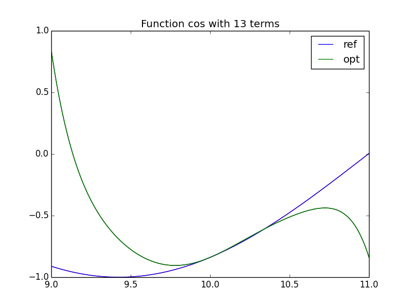
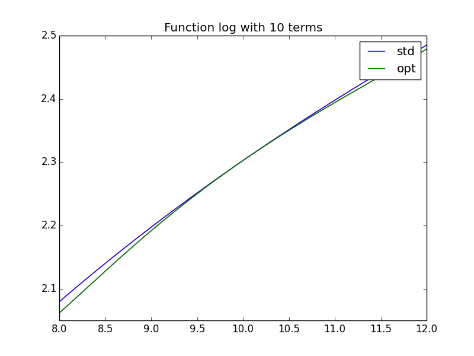
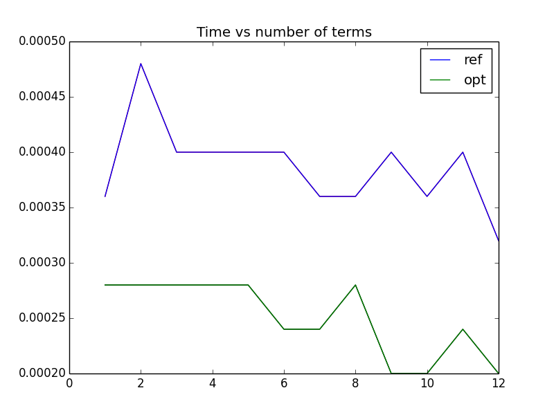

# CE3102-TaylorSIMD
SIMD optimization for aproximation of functions and statistics

This project used the following libs inside the code:
 - matplotlibcpp
 - cxxopts

## Usage
```
  anpiSIMD [OPTION...]
  
    -l, --log             Use log for example
    -c, --cos             Use cos for example
    -g, --graph           Make a graph
    -i, --start arg       Set graph start point
    -f, --end arg         Set graph end point
    -o, --output arg      Output of the graph
    -t, --time            Make a time test for both algorithms
    -e, --error           Make an error percentage test
    -x, --value arg       X to be evaluated
    -a, --terms arg       Number of terms for coeficients
    -n, --ntests arg      Number of tests
    -p, --precission arg  Precission std::cout
    -h, --help            Print help
```

## Examples
Use of the command line for this project
### Error for log
Command:
```
    anpiSIMD --value 10 --terms 10 --ntests 10 --log --error -p 30
```
Output:
```
    f(x)=2.30258509299404590109361379291
    Error for x = 10 : 0 %
    Error for x = 9.199999988079071044921875 : 0.19949583735245743354447256479 %
    Error for x = 8.39999997615814208984375 : 1.63369389416313248730716622958 %
    Error for x = 7.599999964237213134765625 : 15.1753518801997557829963625409 %
    Error for x = 6.7999999523162841796875 : 135.359971981492293480187072419 %
    Error for x = 5.999999940395355224609375 : 899.694698685236630808503832668 %
    Error for x = 5.19999992847442626953125 : 4588.07381675209217064548283815 %
    Error for x = 4.399999916553497314453125 : 19274.85963667290707235224545 %
    Error for x = 3.599999904632568359375 : 71217.7447003356064669787883759 %
    Error for x = 2.799999892711639404296875 : 248294.178710889769718050956726 %
```
### Time tests for cos
Command:
```
    anpiSIMD --value 10 --terms 10 --ntests 25000 --cos --time -p 30
```
Output:
```
    f(x)=-0.839071529076452438111743958871
    Reference time: 0.000360000000000000022672835831017
    Optimized time: 0.000240000000000000006080205783299
```

### Graphs
Command:
```
anpiSIMD -g -n 200 --cos -o ../images/cos10.png --terms 10 --start 9 --end 11
```
Output:




Command:
```
anpiSIMD -g -n 200 --log -o ../images/log10.png --terms 10 --start 8 --end 12
```
Output:


Command:
```
anpiSIMD -g -n 200 --log -o ../images/logtime10.png --time -x 12
```
Output:



Command:
```
anpiSIMD -g --log -o ../images/logerror.png --error
```
Output:
